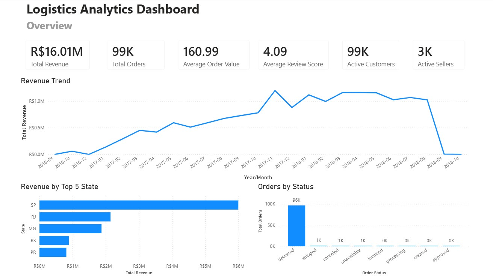
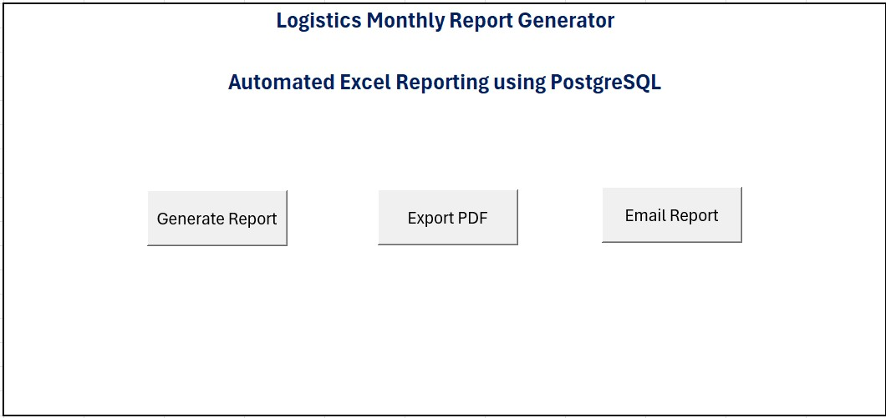
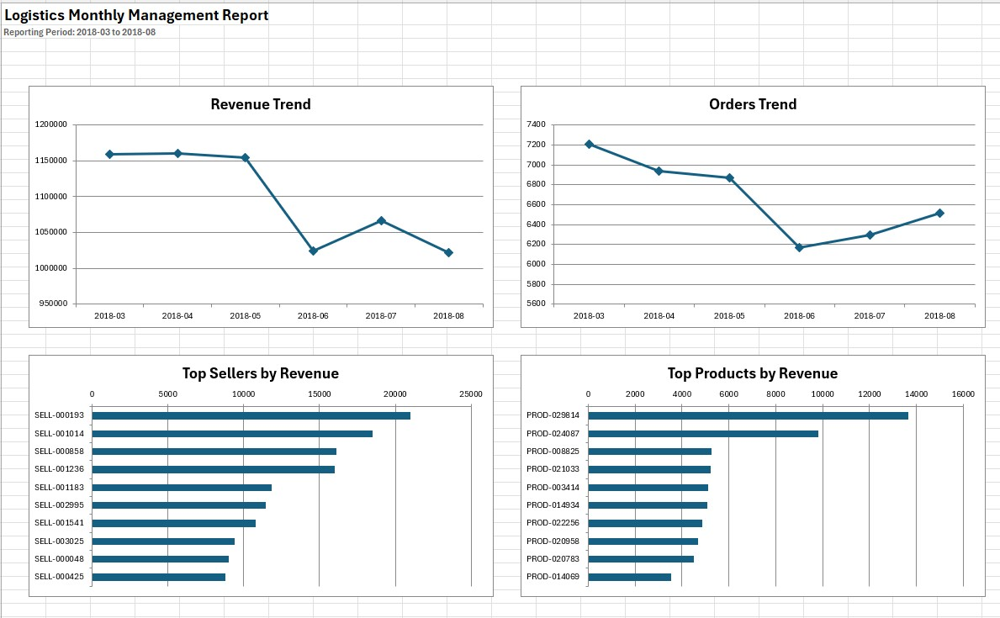

# E-Commerce BI & Reporting Platform

## Overview

This project demonstrates an end-to-end order analytics reporting solution built using **PostgreSQL**, **Python**, **Power BI**, and **Excel VBA**.

The system processes e-commerce order data into a star schema, loads it into PostgreSQL, visualizes business KPIs in Power BI, and automatically generates management reports in Excel and PDF.

---

## Features

### Data Engineering

* ETL pipeline using Python
* Data cleaning and transformation
* Star schema design
* PostgreSQL database loading

### Business Intelligence

Power BI dashboard including:

* Revenue analysis
* Order trends
* Customer analytics
* Seller performance
* Product performance
* Delivery KPIs

### Automated Excel Reporting

Excel VBA application that connects directly to PostgreSQL through ODBC.

Functions include:

* Generate monthly management report
* Automatically retrieve the latest available reporting period
* Revenue trend chart
* Orders trend chart
* Top Sellers chart
* Top Products chart
* Late Delivery % trend
* Export report to PDF
* Generate Outlook email draft with PDF attachment

---

## Technologies

* Python
* PostgreSQL
* SQL
* Power BI
* Excel VBA
* ODBC
* Outlook Automation

---

## Project Structure

```text
data/
│
├── raw/
└── processed/

etl/
├── build_processed_data.py
└── load_to_postgres.py

sql/
├── create_tables.sql
└── reporting_queries.sql

powerbi/
└── order_analytics_dashboard.pbix

excel/
└── Monthly_Report_Generator.xlsm
```

---

## Workflow

```text
Raw CSV Files
        │
        ▼
Python ETL
        │
        ▼
Processed Data
        │
        ▼
PostgreSQL
        │
 ┌──────┴─────────┐
 │                │
 ▼                ▼
Power BI     Excel VBA
                  │
                  ▼
      Excel Report / PDF / Email
```

---

## Screenshots

### Power BI Dashboard


### Excel Dashboard


### Monthly Report


---

## Skills Demonstrated

* Data Engineering
* SQL
* PostgreSQL
* ETL Development
* Power BI
* Dashboard Design
* Excel VBA Automation
* Database Connectivity (ODBC)
* Report Automation
* Business Intelligence

---

## Data Source

**Brazilian E-Commerce Public Dataset (Olist)**: https://www.kaggle.com/datasets/olistbr/brazilian-ecommerce
